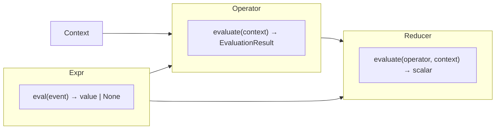

# Architecture

Event-based feature intermediate representation: **Expr → Operator → Reducer** over a shared `Context`.

## Constraints

- `Expr` and `Operator` are **disjoint** AST domains — no shared ABC. `_require_expr` and `_require_operator` enforce this at construction time.
- DO NOT put an `Operator` inside an `Expr` tree, or an `Expr` where an `Operator` is expected.
- There is **no** `BoolExpr` or `Where` layer. Compose selection with `And`, `Or`, `Not`, and `Difference` on Operators.
- `Expr` **projects** values per event; it never filters the event list.
- `Operator` **selects** events; it never aggregates or projects reducer inputs directly.
- `Reducer` **aggregates** over the events returned by an Operator (`EvaluationResult.data`).
- Logical Operators (`And`, `Or`, `Not`, `Difference`) match events by `context.key(event)`, not by object identity.

## Pipeline



| Layer | Input | Output | Responsibility |
|-------|-------|--------|----------------|
| Expr | one `event` dict | `Any \| None` | Project a value from one row |
| Operator | `Context` | `EvaluationResult` | Filter `Context.events` |
| Reducer | `Operator` + `Context` | scalar (`int`, `float`, `bool`, …) | Aggregate over selected events |

### Canonical example

From [`tests/test_feature_pipeline.py`](../tests/test_feature_pipeline.py):

```python
op = And(
    Gt(Field("amount"), Const(50)),
    In(Field("currency"), Const(frozenset({"SEK", "USD"}))),
)
result = Sum(Field("amount")).evaluate(op, context)
# result == 300
```

The Operator narrows `Context.events`; the Reducer runs `Sum` over `op.evaluate(context).data`.

## Package layout

| Package | Role | Key modules |
|---------|------|-------------|
| `core/` | Shared runtime types | `context.py` (`Context`), `result.py` (`EvaluationResult`) |
| `expressions/` | Expr AST + per-event evaluation | `base.py`, `fields.py`, `evaluate.py`, `arithmetic.py`, `string.py`, `control.py` |
| `operators/` | Operator ABC + all selection | `base.py`, `logical.py`, `comparison.py`, `membership.py`, `strings.py`, `presence.py`, `temporal.py`, `relation.py` (stub) |
| `util/` | Shared operator helpers | `selection.py` (predicate loops), `validate.py` (`_require_operator`) |
| `reducers/` | Aggregation over operator output | `numeric.py`, `counting.py`, `boolean.py` |

`tests/` mirrors `src/llm_decision_spec/` at the first directory level (`operators/`, `expressions/`, `util/`, `reducers/`, `core/`). Shared test helpers live in `tests/utils/` (not a source package).

## Key types

### `Context`

Defined in [`core/context.py`](../src/llm_decision_spec/core/context.py).

| Field / method | Meaning |
|----------------|---------|
| `events` | Full universe of event dicts |
| `event_key_fn` | Stable identity for each event (used by logical Operators) |
| `event_datetime_fn` | Extract datetime from an event |
| `context_datetime` | Reference time for relative temporal Operators |
| `key(event)` | Shorthand for `event_key_fn(event)` |
| `datetime(event)` | Shorthand for `event_datetime_fn(event)` |

### `EvaluationResult`

Defined in [`core/result.py`](../src/llm_decision_spec/core/result.py).

| Field | Meaning |
|-------|---------|
| `data` | Selected events (`list[dict]`) |
| `metadata` | Optional bag for future use (currently unused) |

## Data flow

1. Build an `Operator` tree (optionally using `Expr` leaves for comparisons).
2. Call `operator.evaluate(context)` → `EvaluationResult`.
3. Pass the operator (not just `.data`) to `reducer.evaluate(operator, context)`.
4. The reducer re-evaluates the operator internally and aggregates over `.data`.

Value-driven Operators (comparison, membership, strings) delegate event iteration to helpers in [`util/selection.py`](../src/llm_decision_spec/util/selection.py). Logical Operators delegate child validation to [`util/validate.py`](../src/llm_decision_spec/util/validate.py).

## See also

- [domain.md](domain.md) — event model, `None` propagation, temporal semantics
- [conventions.md](conventions.md) — how to add new Expr / Operator / Reducer types
- [decisions/001-expr-operator-disjoint.md](decisions/001-expr-operator-disjoint.md)
